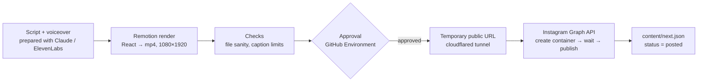

# ai-video-factory

Short educational cybersecurity videos (Reels) rendered from code and published to Instagram on a schedule, with a human approval step before anything goes live.



## How it works

- **Video**: a Remotion project (`src/`) turns `lines.json` + voice timing into a vertical video with a mascot, on-screen visuals, captions and sound effects.
- **Pipeline**: `.github/workflows/reel.yml` renders the video, validates it and the caption, then waits for manual approval (environment `instagram-publish`) before publishing.
- **Publishing**: `tools/publish_instagram.py` uses the official Instagram API (Instagram Login). Instagram fetches Reels only from a public URL, so the runner opens a temporary Cloudflare tunnel to the rendered file.
- **Episodes**: `content/next.json` says what to publish: a Remotion composition (`composition`) or a ready-made mp4 (`video`), plus a caption file (`caption`). Values are validated before they reach any shell command.
- **Token renewal**: `.github/workflows/token.yml` refreshes the Instagram token twice a month, checks that the new token can publish, and writes it into the repository secret with `gh secret set` (the value goes through stdin and is never printed).
- **No duplicates**: `content/next.json` holds the queue state. Only an episode with `status: pending` is published; after a successful post the workflow marks it `posted`.

## Tests

```bash
pip install -r requirements.txt
python -m unittest discover -s tests -v
```

The tests run against a fake Instagram Graph API on localhost, so the whole publish flow (container → status polling → publish), error hints, token redaction, Range-request video serving and the no-duplicate queue logic are covered without network access. The same tests run first in every workflow run.

## Setup

1. Repository secrets: `IG_USER_ID`, `IG_ACCESS_TOKEN` (never commit them; `.env` is git-ignored).
2. Environment `instagram-publish` with yourself as required reviewer.
3. For automatic token renewal: secret `GH_SECRETS_PAT`, a fine-grained GitHub token limited to this repository with *Secrets: read and write*.
4. Run the workflow manually with *dry run* first, then enable the `schedule:` trigger.

Instagram long-lived tokens expire after about 60 days. Meta returns a new token on every refresh, so `token.yml` verifies it and stores it in the repository secret.

## Stack

Python (requests, unittest), Remotion/React/TypeScript for rendering, GitHub Actions, Instagram Graph API, ElevenLabs.
